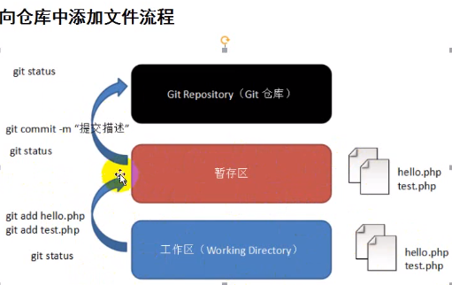

# github入门教程

代码托管，本地建仓，实现多台设备协作

# 注册

直接到github官网注册就行

# 主要界面和标签

仓库主页、个人主页

start就是收藏；watch就是关注（有动态会提醒）

comment：每次操作提交都可以会记录

issue：问题bug其它用户或者自己提出，可以指定团队处理人

pull request: fork我仓库的人修改提出的请求，我受到可以merge也可以拒绝

# 远程管理仓库

## 建立连接初始化本地仓库

ssh链接一次配置终身使用

生成公钥：**ssh-keygen -t rsa **

window系统生成的公钥在/c/Users/llh/.ssh/id_rsa

粘贴公钥到github的SSH keys/Add new


初次使用需要设置user.name和email.name每次push会用到

进入文件**初始化配置**：

_**设置用户名**_： git config --global user.name 'FattyAutoMan'

_**设置用户邮箱**_：  git config --global user.email	’your email addr'

_**查看设置**_： git config --list

可以直接打开文件进行设置：

每次git push都要输入两次用户和密码，晕！！

克隆仓库选择ssh链接而不是https

如何判断自己仓库链接？ **git remote  -v**

发现是https就移除：**git remote rm originyuanyo**

修改为ssh链接：**git remote add origin ssh的地址**

## bash基本操作

和linux命令差不多

新建文件夹：**mkdir filefoldername**

新建文件：**touch filename**

初始化git仓库：**cd filename**

​                         git init 会生成.git文件（存储仓库信息）

​                      如果远程拷贝就自带.git

修改文件：**vi filename**

  wq保存并退出

q！不保存退出

rm 文件名

rm -f 文件名

## 向本地仓库中添加文件



**git status** 查看本地仓文件状态：红色工作区，绿色暂存区

到暂存区：**git add 文件名**

提交到git仓库 **git commit -m 提交描述**

提交到远程仓库**git push**

一次add所有修改： **git add .**

## 从本地仓库中删除文件

**rm filename/  rm -rf filename**

**git rm filename**

**git commit -m '提交描述'**

**git push**

## 提交到远程仓库


1.远程仓库克隆到本地: **git clone 远程仓库网址**

2.将本地.git推到远程： **git push**

报错改用

**git push --set-upstream origin main**


-u 第一次提交带上该选项，其后的每次提交只需要git push即可

**git push -u origin master**

*如果你不是克隆的仓库，并且是第一次提交，你需要先**添加远程仓库***

添加远程仓库**git remote add origin git@github.com:FattyAutoMan/JavaLearning.git**

 **git remote -v**

查看已经添加的远程仓库

## git push报错解决

1）**erro**: no upstream of main

sol: **git push --set-updtream origin**

2）**erro**: 有时候因为远程仓库被别人改过，导致有些文件本地没有，为了安全，会报错。因此需要重新fetch管程仓，然后合并和本地

**git fetch origin main**

**git merge origin FETCH_HEAD **

（2）这2句命令等价于**git pull origin main**

但是使用git fetch + git merge 更加安全。

（3）**git pull --rebase origin main**

**重定基**，可以是历史更加统一，即使提交历史趋向于一条直线。

**git push -f 或者 git push --force**

强推，即利用强覆盖方式用你本地的代码替代git仓库内的内容

## 本地版本控制指令

创建testdir目录并进入该目录；始化并创建了一个本地git仓库

把文件添加到**缓存区**

```git
mkdir testdir && cd testdir> git init
```

后悔了，你可以撤销这个操作

--cache只是把文件**撤出缓存区**，不加的话就会连本地文件一起删除

```
git rm --cache readme.md
```

提交到本地版本库

```
git commit -m "这是一段文本注释，解释提交改动了什么，随便写"
```

你又后悔了，你可以重置代码

–hard 选项表示**丢弃当前工作区的更改**，直接代码回滚

–soft，**保留**当前工作区更改，并回滚代码

比如回到版本  b5176eace提交后状态：hard是本地仓和 b5176eace内容一样； soft是不改变当前本地仓内容

```
git reset  --hard  //git reset b5176eace --hard
```

每次commit的时候，git 都会产生一个 commitId，这个commitId，可以通过log命令查看，然后对本地仓库回滚

```
 git log --pretty=oneline
```

重置之后后悔了咋办，可以撤销重置

```
git reflog --pretty=oneline
```

## 本地新仓push到远程仓

建立ssh连接后

远程仓无该仓就需要-u

git push -u origin main

下次上传就可以**省略-u**


## 分支的新建和合并

```git branch iss53console
git branch branchname
git checkout branchname
git merge branchname
```

删除本地分支

```console
git branch -d branchname
```

## 合并冲突

在两个不同的分支中，对同一个文件的同一个部分进行了不同的修改，Git 就没法干净的合并它们

```git
git merge iss53
Auto-merging index.html
CONFLICT (content): Merge conflict in index.html
Automatic merge failed; fix conflicts and then commit the result.
```

查看具体状态

```console
$ git status
On branch master
You have unmerged paths.
  (fix conflicts and run "git commit")

Unmerged paths:
  (use "git add <file>..." to mark resolution)

    both modified:      index.html

no changes added to commit (use "git add" and/or "git commit -a")
```

**修改冲突**

 Git 会在有冲突的文件中加入标准的冲突解决标记，这样你可以打开这些包含冲突的文件然后手动解决冲突。 

```html
<<<<<<< HEAD:index.html
<div id="footer">contact : email.support@github.com</div>
=======
<div id="footer">
 please contact us at support@github.com
</div>
>>>>>>> iss53:index.html
```

 例如，你可以通过把这段内容换成下面的样子来解决冲突：

```html
<div id="footer">
please contact us at email.support@github.com
</div>
```

# 将远程仓库更新到本地

```
git pull
```


# 协作请求合并

